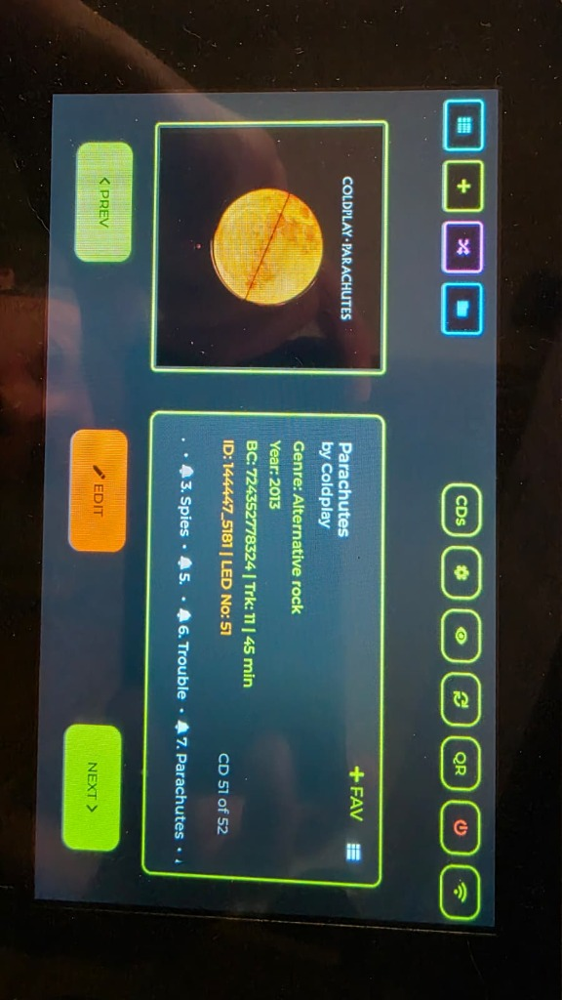
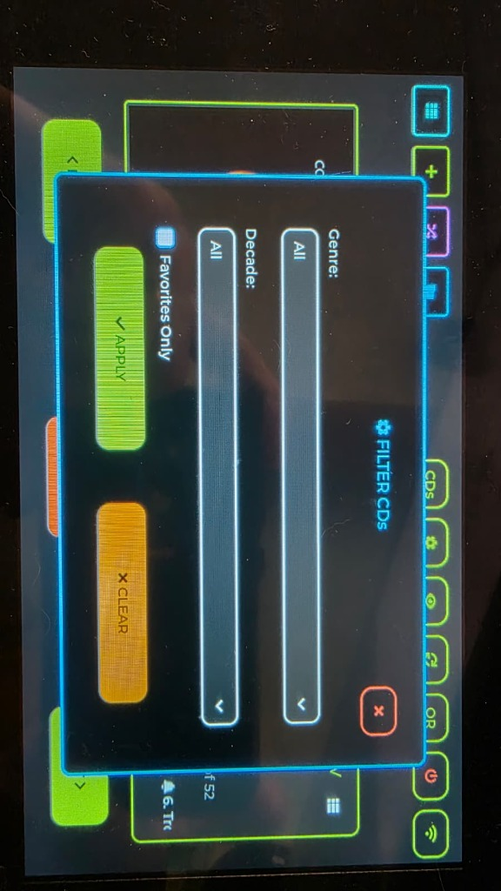
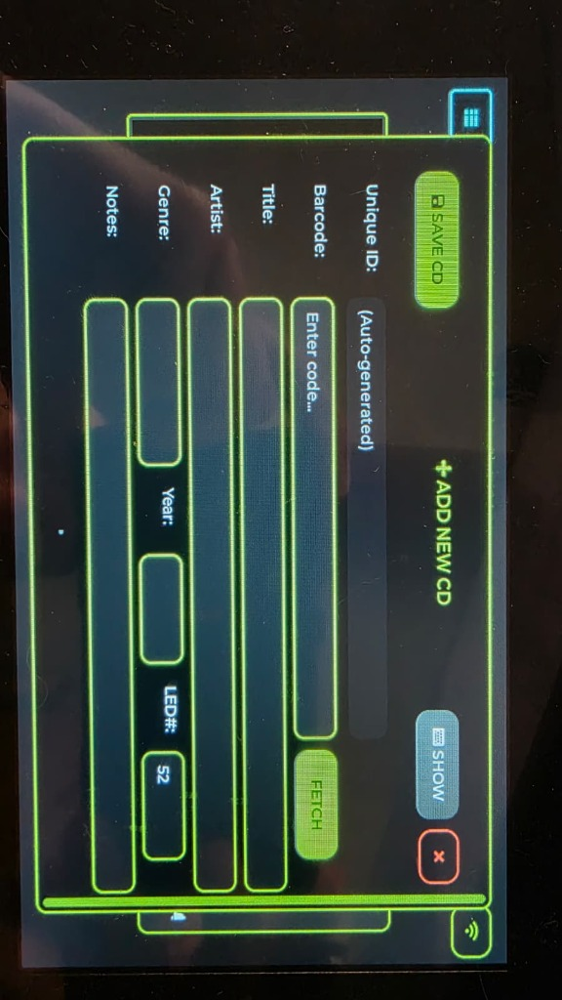
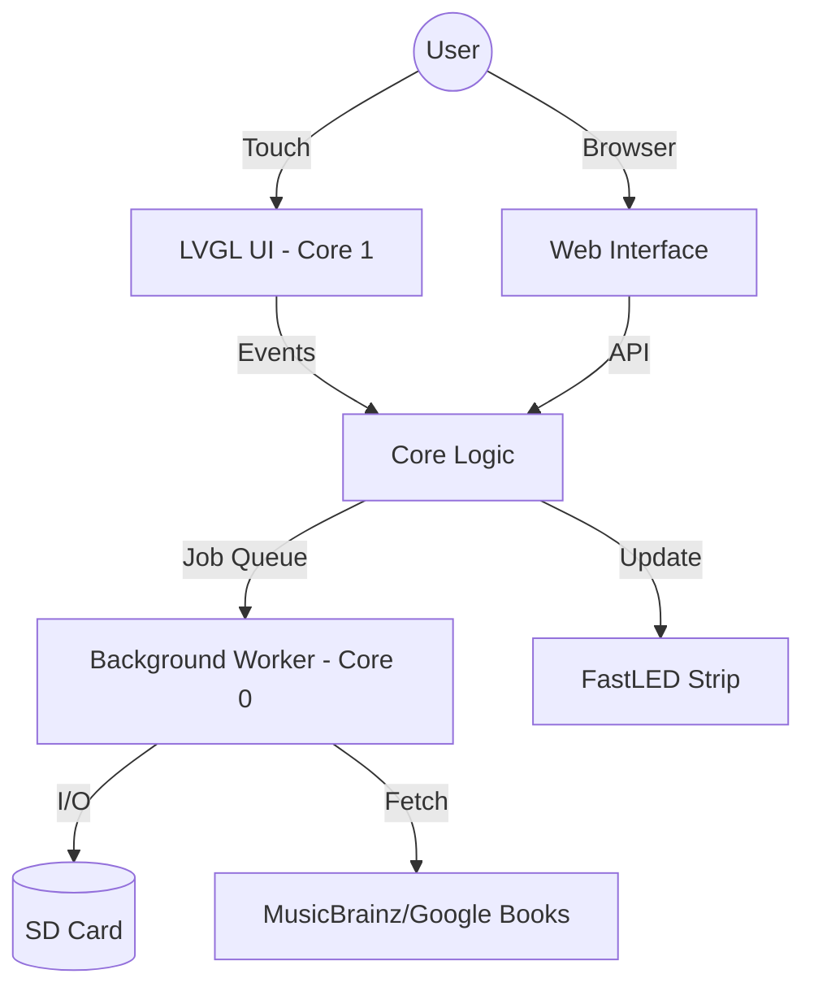

# 📚 Digital Librarian (ESP32-S3)

**Digital Librarian** is a high-performance, physical media management system running on the **Waveshare 7" ESP32-S3 Touch LCD**. It bridges the gap between your physical collection (CDs, Books) and the digital world by providing instant metadata lookups and a visual shelf-locator system.

---

## 📸 Gallery

| Main Interface | Smart Filtering |
|:---:|:---:|
|  |  |
| *High-fidelity browse view* | *Drill down by genre or decade* |

| Add New Media | Dynamic Themes |
|:---:|:---:|
|  |  |
| *Barcode & ISBN lookup* | *Customizable CD/Book themes* |

---

## 📖 User Guide

### Overview
Digital Librarian turns your media shelf into an interactive experience. Use the 7-inch touch screen or your smartphone to browse, search, and physically locate items.

### Features
*   **Browsing**: Swipe through your collection with instant cover art loading.
*   **Searching**: Tap the search icon to find items by Title, Artist, or Author. Real-time filtering makes finding "Sci-Fi from the 80s" a breeze.
*   **Locating**: Tap any item to light up its exact position on your shelf via the LED strip.
*   **Adding Items**:
    1.  Tap **Add New**.
    2.  Scan the barcode or enter the ISBN/UPC.
    3.  Metadata and cover art are automatically fetched from MusicBrainz (CDs) or Google Books.
*   **Web Interface**: Access `http://digitallibrarian.local` on your phone to manage your library from the comfort of your couch.

---

## 👨‍💻 Developer Guide

### Technical Specifications
*   **MCU**: ESP32-S3 (Xtensa LX7 Dual Core, 240MHz)
*   **Memory**: 8MB PSRAM (OPI), 16MB Flash (QSPI)
*   **Display**: 7-inch IPS (1024x600) with Capacitive Touch (GT911)
*   **Connectivity**: 2.4GHz WiFi
*   **Peripherals**:
    *   **SD Card**: SDMMC (4-bit mode) for database and image storage.
    *   **LEDs**: WS2812B (Data Pin: GPIO 6)
    *   **IO Expander**: CH422G (via I2C) for backlight and reset control.

### Setup & Installation
1.  **Dependencies**:
    *   [PlatformIO](https://platformio.org/) (Recommended IDE)
    *   LVGL 8.3
    *   ArduinoJson 6.x
    *   FastLED

2.  **Configuration**:
    *   Rename `secrets.example.h` to `secrets.h` and add your WiFi credentials.
    *   Copy the `/libs` folder to your library path if not using PlatformIO's lib_deps.

3.  **Compiling**:
    *   **Board**: `esp32s3`
    *   **Flash Mode**: QIO 80MHz
    *   **PSRAM**: OPI (Critical for LVGL performance)

### Architecture
The system uses a **Dual-Core Architecture** to ensure smooth UI performance:
*   **Core 1 (UI Task)**: Runs the LVGL loop. Handles touch input, animations, and rendering.
*   **Core 0 (Background Task)**: Handles heavy lifting:
    *   WiFi / API Requests (MusicBrainz, Google Books)
    *   SD Card I/O (Database reads, Cover art caching)
    *   LED Control (FastLED timing)

---

## 📜 License
This project is licensed under the MIT License. See [LICENSE](LICENSE) for details.

## 🙏 Credits
*   **Metadata**: [MusicBrainz](https://musicbrainz.org/), [Google Books](https://books.google.com/), [Discogs](https://www.discogs.com/), and [Apple iTunes](https://www.apple.com/itunes/).
*   **UI Framework**: [LVGL](https://lvgl.io/).
*   **Logic**: Powered by ESP32-S3.
