# 📚 Digital Librarian (ESP32-S3)

**Digital Librarian** is a smart physical media management system running on the **Waveshare 7" ESP32-S3 Touch LCD**. It acts as a "physical search engine" for your library: simply search for an item on the screen or your phone, and an **addressable LED strip** will instantly light up its exact location on your shelf.

---

## 📸 Gallery

| Main Interface | Smart Filtering |
|:---:|:---:|
| 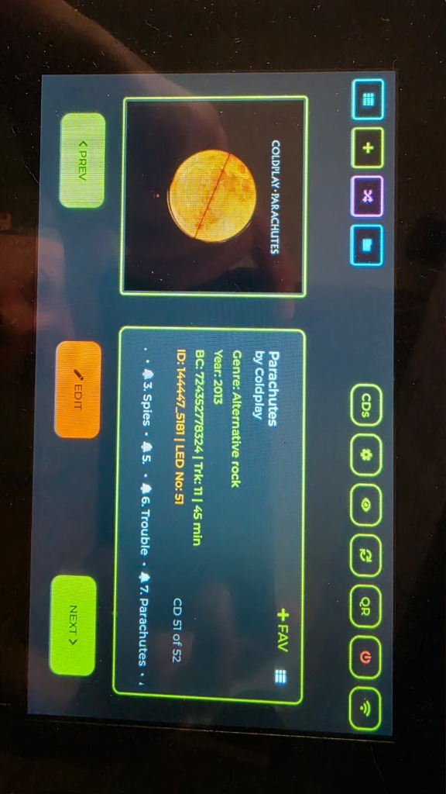 | 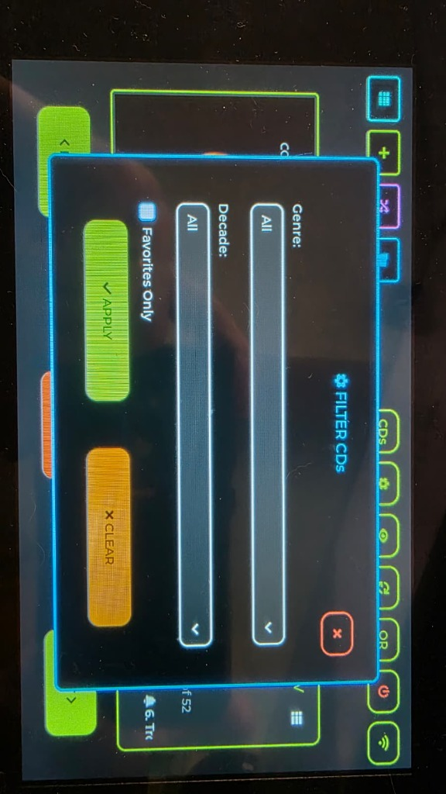 |
| *High-fidelity browse view* | *Drill down by genre or decade* |

| Add New Media | Dynamic Themes |
|:---:|:---:|
| 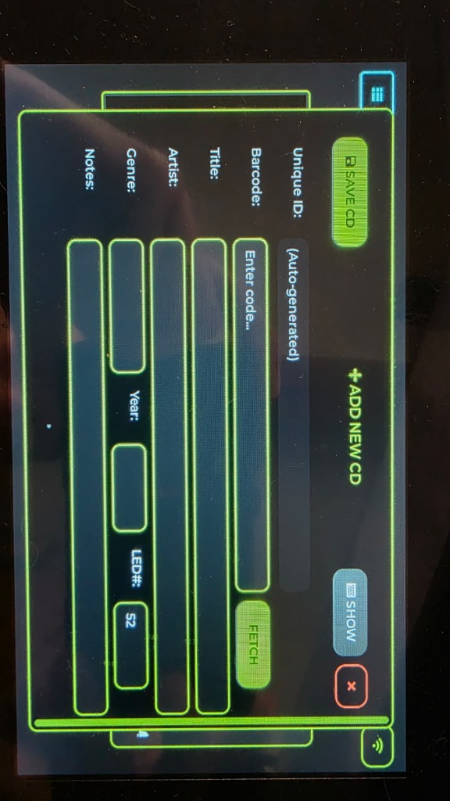 | 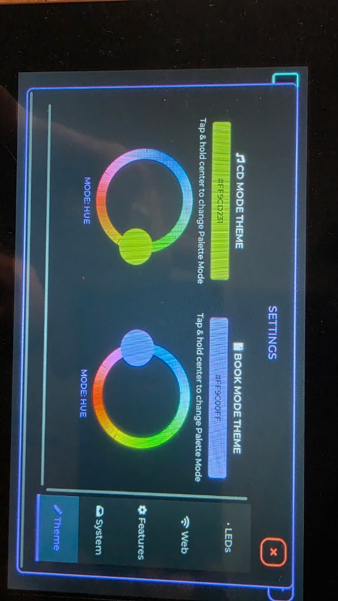 |
| *Barcode & ISBN lookup* | *Customizable CD/Book themes* |

| Tracklists | Synced Lyrics |
|:---:|:---:|
| 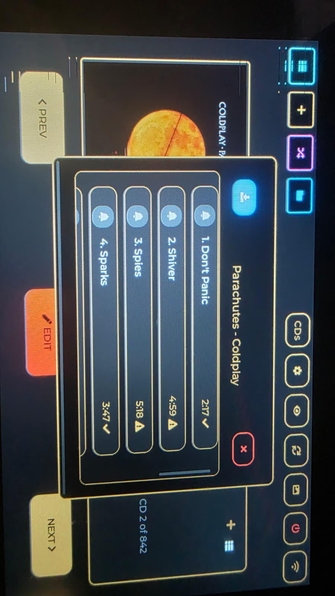 | 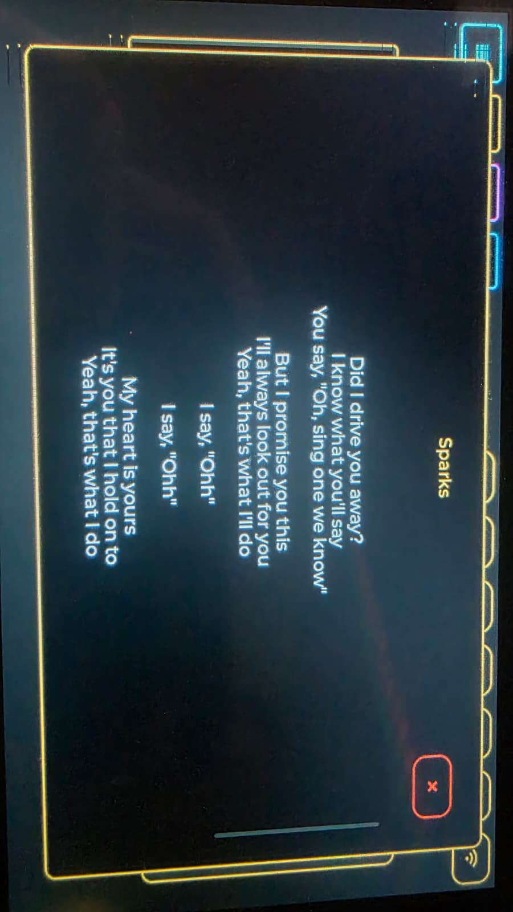 |
| *Full tracklist support* | *Live lyrics display* |

| Web Dashboard | Web Scanner |
|:---:|:---:|
| 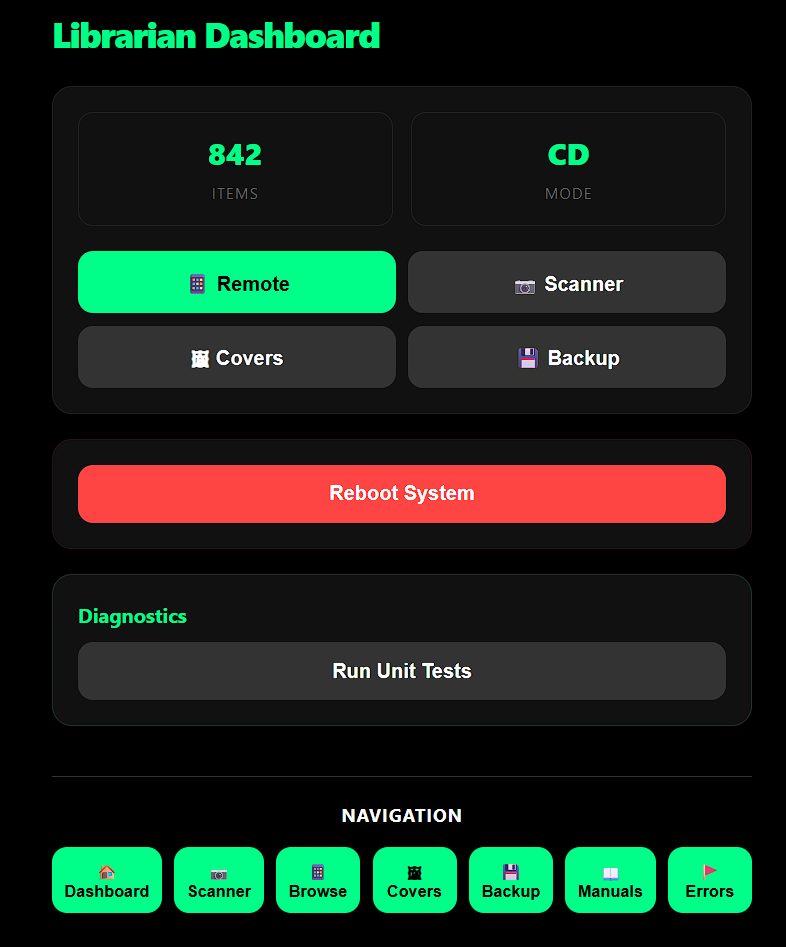 | 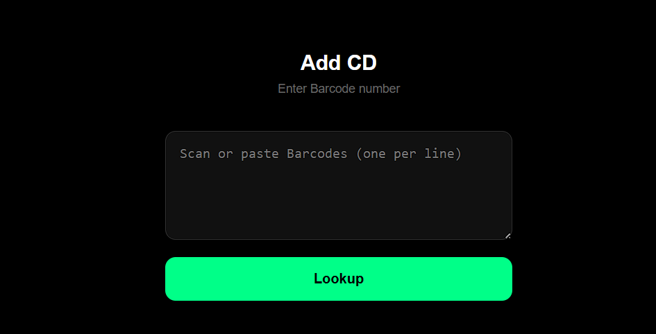 |
| *Remote management hub* | *Mobile-friendly bulk scanning* |

| Web LED Selector | Web Art Manager |
|:---:|:---:|
| 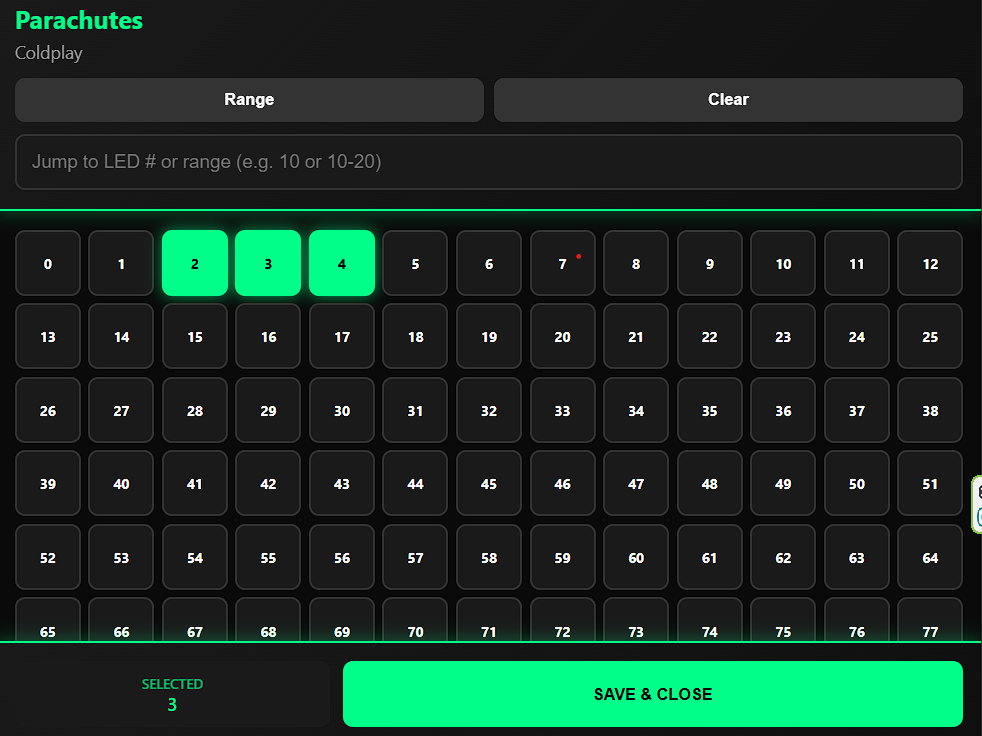 | 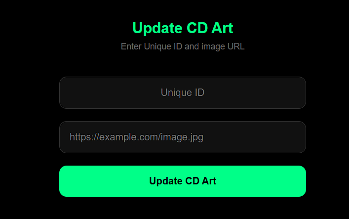 |
| *Visual LED mapping* | *Manual artwork overrides* |

---

## �️ Hardware Highlights
The heart of this project is the **Waveshare ESP32-S3-Touch-LCD-7**, a high-performance development board that combines raw processing power with a stunning display.

  

### Board Features:
*   **Dual-Core ESP32-S3**: Core 1 runs the Arduino/LVGL loop while the background worker is scheduled independently for network and storage jobs.
*   **7" RGB LCD**: 800x480 resolution with a 16-bit RGB interface.
*   **Capacitive Touch**: Responsive 5-point touch support for an intuitive user experience.
*   **Expandable Storage**: Integrated Micro SD slot for storing thousands of item records and cover art images.
*   **Built-in IO Expander**: CH422G chip provides additional GPIO for screen backlight control and resets without consuming primary ESP32 pins.

## �📖 User Guide

### Overview
Digital Librarian turns your media shelf into an interactive experience. Use the 7-inch touch screen or your smartphone to browse, search, and physically locate items.

### Features
*   **Browsing**: Swipe through your collection with instant cover art loading.
*   **Searching**: Tap the search icon to find items by Title, Artist, or Author. Real-time filtering makes finding "Sci-Fi from the 80s" a breeze.
*   **Locating**: Tap any item to light up its exact position on your shelf via the LED strip.
*   **Adding Items**:
    1.  Tap **Add New**.
    2.  Scan the barcode or enter the ISBN/UPC.
    3.  Metadata and cover art are automatically fetched from MusicBrainz (CDs) or Google Books.
*   **Web Interface**: Access `http://digitallibrarian.local` on your phone to manage your library from the comfort of your couch.

---

## 👨‍💻 Developer Guide

### Technical Specifications
*   **MCU**: ESP32-S3 (Xtensa LX7 Dual Core, 240MHz)
*   **Memory**: 8MB PSRAM (OPI), 8MB Flash (QIO build target)
*   **Display**: 7-inch IPS (800x480) with Capacitive Touch (GT911)
*   **Connectivity**: 2.4GHz WiFi
*   **Peripherals**:
    *   **SD Card**: SDMMC (4-bit mode) for database and image storage.
    *   **LEDs**: WS2812B (Data Pin: GPIO 6)
    *   **IO Expander**: CH422G (via I2C) for backlight and reset control.

### Setup & Installation
1.  **Dependencies**:
    *   **Arduino IDE**
    *   **ESP32 Board Package** (by Espressif)
    *   LVGL 8.4.0
    *   ArduinoJson 7.4.2
    *   FastLED 3.10.3

2.  **Configuration**:
    *   Rename `secrets.example.h` to `secrets.h` and add your WiFi credentials.
    *   Keep the repository's `/libraries` folder available to the sketch.
    *   The sketch-root `Waveshare_ST7262_LVGL.cpp/.h` files are the authoritative display/touch port used by the verified build. Their vendored library copies are kept synchronized so Arduino IDE library discovery cannot select stale hardware code.
    *   See [`docs/BUILD_ENVIRONMENT.md`](docs/BUILD_ENVIRONMENT.md) for the complete verified versions and board options.

3.  **Compiling**:
    *   **Board**: Waveshare ESP32-S3 Touch LCD 7
    *   **Flash Mode**: QIO; **Flash Size**: 8 MB; **Partition**: Huge APP
    *   **PSRAM**: Enabled (critical for LVGL performance)
    *   Run `tools/verify-build.ps1` for a compile-only verification with the exact target options.

### Architecture
The system separates interactive UI work from queued network and storage work:
*   **Core 1 (UI Task)**: Runs the LVGL loop. Handles touch input, animations, and rendering.
*   **Background Worker**: Scheduled by FreeRTOS and handles heavier work without blocking the UI:
    *   WiFi / API Requests (MusicBrainz, Google Books)
    *   SD Card I/O (Database reads, Cover art caching)
    *   LED Control (FastLED timing)

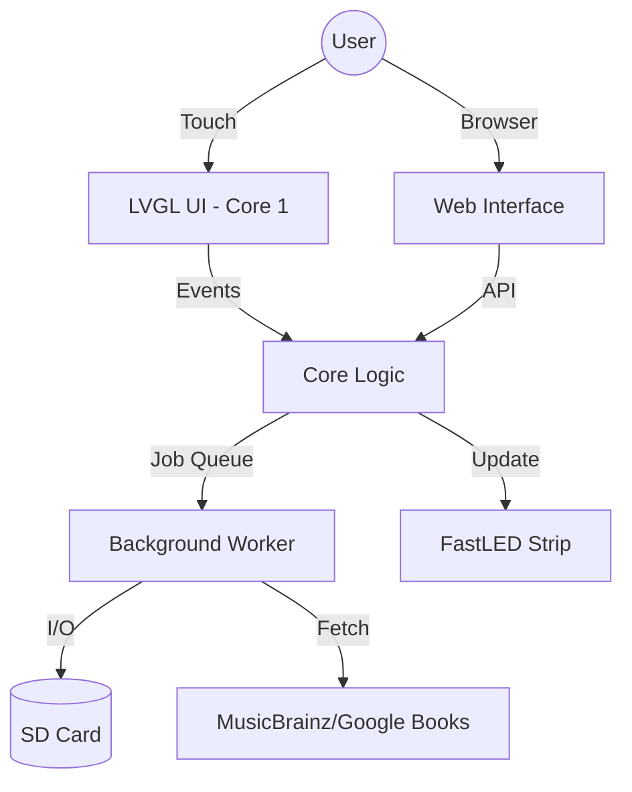
```mermaid
graph TD
    User((User)) -->|Touch| UI[LVGL UI - Core 1]
    User -->|Browser| Web[Web Interface]
    
    UI -->|Events| Core[Core Logic]
    Web -->|API| Core
    
    Core -->|Job Queue| BW[Background Worker]
    BW -->|I/O| SD[(SD Card)]
    BW -->|Fetch| API[MusicBrainz/Google Books]
    
    Core -->|Update| LED[FastLED Strip]
```

### Hardware Connections
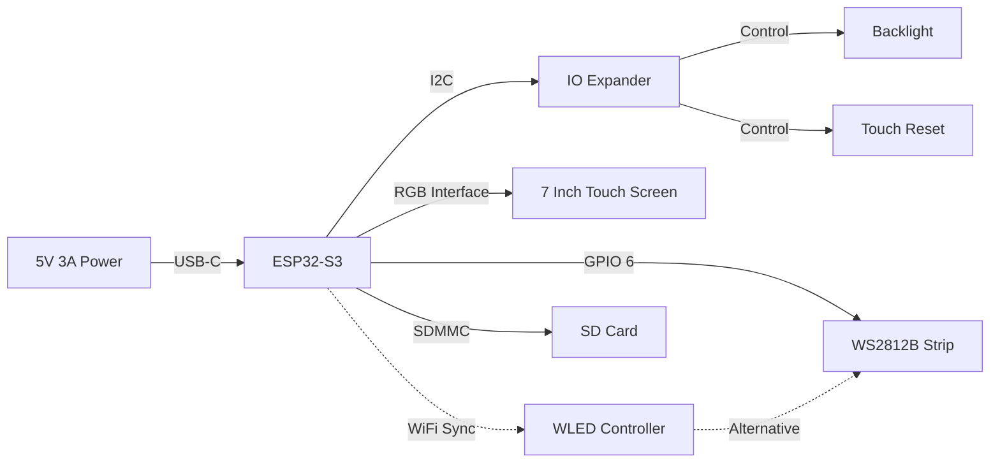
```mermaid
graph LR
    PSU[5V 3A Power] -->|USB-C| ESP[ESP32-S3]
    ESP -->|I2C| IO[IO Expander]
    ESP -->|RGB Interface| LCD[7 Inch Touch Screen]
    ESP -->|GPIO 6| LED[WS2812B Strip]
    
    ESP -.->|WiFi Sync| WLED[WLED Controller]
    WLED -.->|Alternative| LED
    
    ESP -->|SDMMC| SD[SD Card]
    
    IO -->|Control| LCD_BL[Backlight]
    IO -->|Control| LCD_RST[Touch Reset]
```

### "Add Item" Workflow
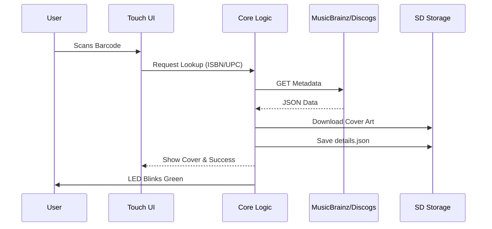
```mermaid
sequenceDiagram
    participant User
    participant UI as Touch UI
    participant Core as Core Logic
    participant API as MusicBrainz/Discogs
    participant SD as SD Storage

    User->>UI: Scans Barcode
    UI->>Core: Request Lookup (ISBN/UPC)
    Core->>API: GET Metadata
    API-->>Core: JSON Data
    Core->>SD: Download Cover Art
    Core->>SD: Save details.json
    Core-->>UI: Show Cover & Success
    Core->>User: LED Blinks Green
```

### "Search & Locate" Workflow
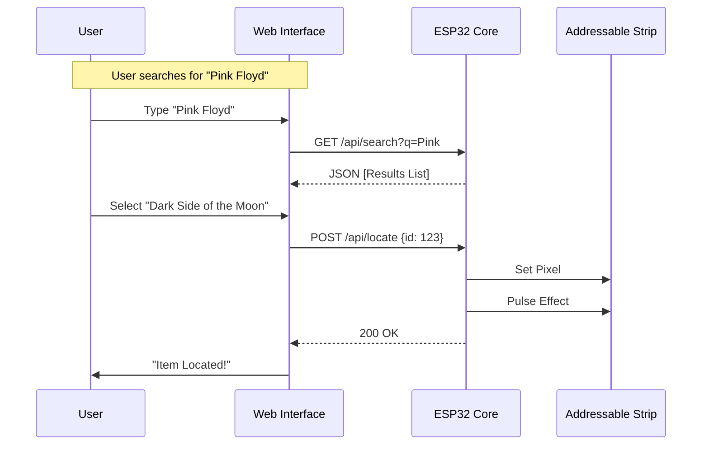
```mermaid
sequenceDiagram
    participant User
    participant Web as Web Interface
    participant ESP as ESP32 Core
    participant LED as Addressable Strip

    Note over User, Web: User searches for "Pink Floyd"
    User->>Web: Type "Pink Floyd"
    Web->>ESP: GET /api/search?q=Pink
    ESP-->>Web: JSON [Results List]
    
    User->>Web: Select "Dark Side of the Moon"
    Web->>ESP: POST /api/locate {id: 123}
    ESP->>LED: Set Pixel #123 to CYAN
    ESP->>LED: Pulse Effect
    ESP-->>Web: 200 OK
    Web->>User: "Item Located!"
```

---

## 🌐 Web Interface & API
The Digital Librarian features a robust web server for remote management. Access it via `http://digitallibrarian.local` or the device's IP address.

### 📱 User Pages
| Route | Feature | Description |
|:---|-:|-:|
| `/` | **Dashboard** | Overview of library stats and system health. |
| `/browse` | **Remote Control** | Browse library, search, and trigger LEDs from your phone. |
| `/scan` | **Batch Scanner** | Use your phone/computer to scan multiple barcodes into the library. |
| `/link` | **Art Manager** | Manually link high-resolution cover art URLs to items. |
| `/backup` | **Data Safety** | Export full library as `.jsonl` or restore from a backup file. |
| `/manual` | **User Guide** | Integrated technical manual and hardware guide. |
| `/errors` | **Diagnostics** | Real-time memory monitoring and system error logs. |

---

## 🚀 Hands-Free Bulk Scanning
You can turn your phone into a professional barcode scanner that automatically registers media to your library.

1.  **Install a Barcode Scanner app** (Any app that supports "Custom Search URL").
2.  **Log in once** at `http://digitallibrarian.local/scan`, then set the scanner's custom URL to:
    `http://digitallibrarian.local/scan?code={CODE}`
3.  **Start Scanning**: Simply point your phone at your CD/Book collection. The app will open the link, the Web UI will automatically process the lookup, and the ESP32 will light up the designated LED.

### 🛠️ Core API Endpoints (POST/GET)
| Endpoint | Method | Params | Description |
|:---|-:|-:|-:|
| `/api/status` | GET | - | Returns JSON with item counts, heap, and uptime. |
| `/api/control` | POST | `action`, `id` | Remote hardware control (LEDs, navigation). |
| `/api/lookup` | POST | `barcode` | Fetches metadata and adds a record. |
| `/api/setcover` | POST | `url`, `id` | Downloads and attaches cover art to an item. |
| `/api/export_backup`| GET | authenticated cookie | Downloads the entire database in JSONL format. |
| `/api/errors` | GET | authenticated cookie | Detailed diagnostic dump of recent system errors. |
| `/restart` | POST | authenticated cookie or PIN header | Remotely reboots the ESP32. |

---

## 🔒 Security & Authentication
Library pages and mutating API endpoints are protected by a **Web PIN**. After
login, the device stores a random, per-boot HTTP-only same-site session cookie;
the PIN itself is not stored in the cookie or accepted from query strings.

*   On first boot the device generates and saves a unique six-digit PIN. View or change it in device Settings.
*   Do not place the PIN in bookmarks, scanner URLs, or query strings. Open a protected page and use its login screen instead.
*   Outbound HTTPS requests validate server certificates with the CA bundle supplied by the installed ESP32 board core.

---

## 📜 License
This project is open-source. Feel free to use, modify, and distribute it as you like. All I ask is:
*   ⭐ **Star the project** if you find it useful!
*   🙏 **Give credit** if you use it in your own projects.

## 🙏 Credits
*   **Metadata**: [MusicBrainz](https://musicbrainz.org/), [Google Books](https://books.google.com/), [Discogs](https://www.discogs.com/), and [Apple iTunes](https://www.apple.com/itunes/).
*   **Lyrics**: [LRCLib](https://lrclib.net/) and [Lyrics.ovh](https://lyrics.ovh/).
*   **UI Framework**: [LVGL](https://lvgl.io/).
*   **Logic**: Powered by ESP32-S3.
